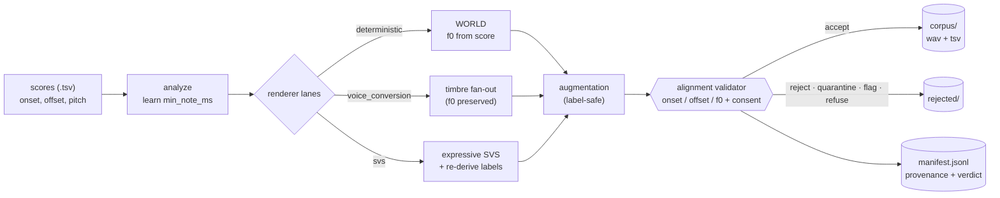
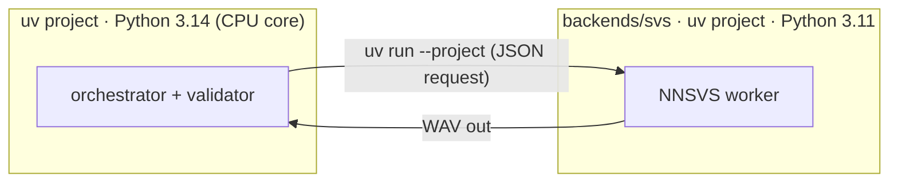

# voders

`voders` turns folders of singing scores into a training corpus of `(audio.wav, score.tsv)`
pairs whose labels are **correct by construction**. Each score is a list of
`(onset_s, offset_s, pitch_midi)` note rows; the pipeline renders singing audio from it and
keeps the score as the ground-truth label, so the label never has to be guessed back from the
audio. An alignment validator gates every sample, and a JSON Lines manifest records full
provenance (which voice, seed, license, and config produced each pair) for replay and audit.

The intended consumer is a transcription model that ingests 22,050 Hz mono float32 audio, so
every rendered sample uses that format.

## Purpose in one paragraph

Training a singing-transcription model needs lots of `(audio, note-labels)` pairs, and the hard
part is **label accuracy**: if a note's onset in the label doesn't match the audio, the model
learns from wrong data. The dominant risk is *alignment drift*, not audio realism. voders removes
that risk by generating the audio **from** the labels — pitch and timing are taken straight from
the score, so the labels are correct by construction — then **gates every sample** through an
alignment validator and records full **provenance** (voice, seed, license, config) so any sample is
auditable and reproducible. The result is a large, in-the-mix, license-clean synthetic corpus a
transcription model can train on with confidence.

## How it works



One declarative YAML config plus a single `master_seed` fully specify a run; the manifest hashes
the resolved config so a corpus replays from `manifest + scores` alone.

## The four renderer lanes

Each lane is enabled or disabled independently in the run config:

1. **deterministic** — drives the pitch directly from the score with the WORLD vocoder (a classic
   analysis/resynthesis vocoder that lets us replace a donor voice's pitch with a score-derived
   contour). This is the load-bearing CPU baseline: f0 (the fundamental frequency, i.e. the sung
   pitch) comes straight from the label, so alignment is exact.
2. **voice_conversion** — keeps the score-accurate timing and pitch but converts the timbre toward
   a target singer, for variety in voice identity.
3. **svs** — expressive neural singing-voice synthesis (SVS), which sings the score with natural
   phrasing; labels are re-derived and re-validated so expressive timing stays within tolerance.
4. **augmentation** — label-preserving production-style effects (noise, room, codec) applied to an
   accepted base render, multiplying the corpus without changing the score.

The deterministic lane and validator run on a laptop CPU with no GPU. The neural lanes
(`svs`, `voice_conversion`) use the `gpu` extra.

## Quickstart

Everything is driven by a [`just`](https://github.com/casey/just) task runner; each action goes
through uv under the hood (Python 3.14), so a fresh checkout needs no manual setup — every action
depends on `setup` (`uv sync`, a fast no-op when already current). Run `just` to list all actions.

Prerequisites: `just` (`sudo apt install just`) and, to build the `pyworld` wheel, a C/C++
toolchain (`sudo apt install build-essential`).

```bash
just                                   # list all actions
just smoke                             # render the fixture corpus, then evaluate it (end-to-end)
just run config=evals/fixtures/smoke.yaml   # render a corpus from a run config
just eval                              # evaluate against the Success Criteria (non-zero on failure)
just audit                             # license/consent audit
just stats                             # aggregate corpus statistics
just splits                            # source-stratified train/val splits (issue #7)
```

`just run` writes under `out/<run_id>/`: `config.resolved.yaml` (the resolved end-result record),
`manifest.jsonl` (one provenance row per attempted sample), `stats.json`, `corpus/` (accepted
`wav`+`tsv` pairs), `rejected/` (non-accepted samples, never trained on), and `checkpoints/`. The
`out/` tree is git-ignored — generated corpora are never committed.

## Consuming the corpus (for training)

If you're training a transcription model on the output, here's what you need:

**Layout.** Train on `corpus/` only — `corpus/**/*.wav` each has a sibling `.tsv` (the label,
byte-identical to the driving score: `onset_s  offset_s  pitch_midi`). `rejected/` holds samples the
validator gated out; never train on it. Audio is 22,050 Hz mono float32.

**Provenance.** `manifest.jsonl` is one JSON row per attempted sample with its `sample_id`,
`lane`, `voice_id`, `augmentation_profile`, `seed`, license/consent, and the `verdict`. `stats.json`
summarises totals, unique scores/voices, timbre identities, and pitch/duration distributions.

**Splits.** `just splits` (`voders splits`) writes `splits.json` with train/val lists
**stratified by source** (lane/voice/augmentation profile) and deterministic in `--seed`, so every
generator is represented on both sides and you can attribute errors to specific sources.

**Quality — what to expect.** The validator gates every sample on onset (50 ms), offset, and f0
(±25 cents over ≥80% of each note), so labels are correct by construction. Against the actual
downstream model, `just basic-pitch-eval` runs **Basic Pitch** on the rendered audio and scores
note-F1 (COnP: onset 50 ms, pitch 50 cents) vs the labels, broken down by verdict status and by
source. Measured on the fixtures (small n — directional, re-run at scale): accepted lanes **0.80–1.00**
(NNSVS 1.0, synthetic donor 0.94, VocalSet donor 0.87, RVC 0.80); rejected samples **~0.48–0.57**.
So the gate is a genuine quality filter; the ±25-cent threshold is calibrated against the consumer
(see `research.md` Decision 9). Use `basic-pitch-eval`'s per-source breakdown to spot weak generators.

## Running tests / development

```bash
just test            # full test suite
just lint            # ruff check + ruff format --check + mypy (zero-warning gate)
just fmt             # auto-format
just bench           # deterministic-lane throughput vs the SC-005 floor
just check           # lint + test (what CI runs)
```

## GPU and neural backends

```bash
just setup-gpu            # add the gpu extra (torch / torchaudio / torchcrepe)
just smoke-gpu           # render, then validate with CREPE (neural f0) on the GPU
just download-rvc-models # fetch the RVC base model weights into models/ (git-ignored)
just demo-svs-nnsvs      # run the SVS lane via its out-of-process NNSVS backend
```

`just setup-gpu` installs torch/torchaudio/torchcrepe (Python 3.14 wheels; verified on an NVIDIA
GB10). **Validator on GPU:** a run config with `validator.f0_method: crepe_f0` measures pitch with
CREPE — a neural f0 (fundamental-frequency) estimator — on the GPU instead of the CPU `pyin`
fallback; `just smoke-gpu` demonstrates it. The CPU default stays `pyin_f0` so the baseline needs
no GPU (FR-009).

`validator.f0_device` selects the accelerator: `auto` probes `cuda → xpu → dml → cpu`. NVIDIA
(`cuda`) is verified here; **Intel/AMD GPUs** are wired to their documented APIs — Intel XPU
(`intel-extension-for-pytorch`) or DirectML on Windows (`uv pip install torch-directml`, then
`f0_device: dml`). Without a matching accelerator it falls back to CPU (so CREPE still runs, just
unaccelerated). CUDA is NVIDIA-only, so an Intel integrated GPU uses `xpu`/`dml`, not `cuda`.

**Out-of-process backends.** Lane toolkits whose dependency chains conflict with the 3.14 core live
in their own uv projects under `backends/` (own `pyproject.toml` / `.python-version` / `uv.lock`).
The core invokes them with `uv run --project backends/<name>` and exchanges a JSON request plus a
WAV, so the incompatible chains never share an interpreter. `backends/svs` runs NNSVS on Python
3.11 (`just demo-svs-nnsvs`).



**Real donor voices.** `just download-donors` streams one consented sample each from **VocalSet**
and **VCTK** (both CC BY 4.0) into git-ignored `models/donors/`; `just demo-real-donor` renders the
deterministic lane with a real human vowel instead of the synthetic fixture.

**Record your own donor vowel.** `just record-donor <voice-id> FILE=take.wav` imports an existing
WAV, or `just record-donor <voice-id> RECORD=1` captures a sustained vowel from the microphone (the
`record` extra pulls in `sounddevice`). Either way it isolates the steady portion, normalizes,
resamples to 22,050 Hz mono float32, validates the take (voiced, low noise), prompts for your
consent, writes the WAV under git-ignored `models/donors/`, and prints a ready-to-paste `Voice`
entry (`kind: deterministic_donor`, `consent_verified: true`). Because you record and consent
yourself, the consent gate (FR-011, SC-008) is satisfied by construction — one ~3 s vowel is enough
for the WORLD/RVC base render. Paste the printed entry under `voices:` in your run config.

**Fetch permissive donor vowels from Freesound.** `just download-freesound` searches
[Freesound](https://freesound.org) for short sung/sustained vowels under a permissive license (CC0
by default — no attribution required), downloads the HQ preview, resamples to 22,050 Hz mono float32,
rejects clips that aren't clearly voiced, and writes donor WAVs under git-ignored
`models/donors/freesound/`. Set `FREESOUND_API_TOKEN` first (get one at
<https://freesound.org/apiv2/apply/>). Tune the search with
`just download-freesound QUERY="sung vowel" COUNT=5 LICENSE=cc0` (use `LICENSE=by` for CC BY, whose
attribution is recorded in `ATTRIBUTION.txt`). Each fetched sound prints a ready-to-paste `Voice`
entry. Run `just list-donors` to see everything fetched/enrolled under `models/donors/` with its
license and attribution.

### Unified data-augmentation pipeline

The donor enrollment methods above are the *data sources*; `just augment` runs them all into one
augmented corpus. It is what the `data-augmentation` GitHub Action runs (manual dispatch or on a
published release).

```bash
just augment                 # all sources -> unified pool -> render -> augment -> audit -> eval -> stats
just augment FREESOUND_COUNT=10   # fetch more Freesound donors this run
just build-pool              # only (re)generate the pool config from donors on disk
just train                   # stub: trains on the augmented corpus manifest (wire in a real trainer)
```

**Every data source is used.** `augment` enrolls donors from all four methods —
synthetic fixtures (`evals/fixtures/voices/`), VocalSet/VCTK (`just download-donors`), Freesound
(`just download-freesound`), and any mic recordings (`just record-donor`) already on disk — then
`evals/build_donor_pool.py` discovers every one of them and writes a single unified run config,
`evals/fixtures/donor_pool.yaml` (committed for review; regenerated each run so newly fetched/recorded
donors join automatically). The fetch steps are best-effort, so the pipeline still runs offline on
the checked-in donors. `just list-donors` prints the current pool with licenses/attribution.

**Which synthesis methods run.** voders routes each voice to a lane by its `kind`
(`src/voders/corpus/orchestrator.py`), so the donor-vowel pool (`kind: deterministic_donor`) is sung
by the **deterministic (WORLD)** lane, and every accepted base render is then fanned through the
label-preserving **augmentation** profiles (`room_reverb`, `phone_codec`, `noisy_room`) — that is the
augmentation multiplier (FR-005). The **svs** (NNSVS) and **voice_conversion** (RVC) lanes consume
voices of kind `svs_voicebank` / `voice_conversion` plus their own out-of-process backends and
consented models, so they are exercised by the dedicated `just demo-svs-nnsvs`, `just demo-rvc`, and
`just demo-seedvc` recipes rather than the donor-vowel pool (a donor vowel can serve as a Seed-VC
*reference*, which `demo-seedvc` shows).

**Where the augmented data is output.** `just augment` writes everything under **`out/donor_pool/`**
(git-ignored — generated corpora are never committed):

| Path | Contents |
| --- | --- |
| `out/donor_pool/corpus/` | accepted samples — paired `*.wav` (22,050 Hz mono float32) + `*.tsv` labels; **this is the augmented training set** |
| `out/donor_pool/manifest.jsonl` | one provenance row per attempted sample (lane, voice, seed, license, augmentation profile, verdict) — what `just train` consumes |
| `out/donor_pool/rejected/` | samples that failed the validator (quarantined, never trained on) |
| `out/donor_pool/stats.json` | aggregate stats (counts, timbre identities, augmentation coverage, pitch/duration distributions) |
| `out/donor_pool/config.resolved.yaml` | the resolved run config (hashed into the manifest for replay) |

**Committed OGG archive (skip regeneration).** Rendering the corpus takes a while, so the accepted
audio is also archived under **`datasets/donor_pool/`** as OGG/Vorbis (~17× smaller than float32 WAV;
versioned via Git LFS), alongside the verbatim `*.tsv` labels, `manifest.jsonl`, `stats.json`, and
`config.resolved.yaml`. `just pack-corpus` builds the archive from `out/donor_pool/` (run it after
`just augment`, then commit `datasets/`); `just unpack-corpus` decompresses it back to WAV at the
exact `out/donor_pool/corpus/.../*.wav` paths the renderer uses. `just train` auto-unpacks when the
corpus isn't already rendered, so training needs no regeneration. OGG is lossy, so a round-trip is
not bit-exact (use `just augment` for bit-exact reproduction); the labels and provenance are exact.

How `datasets/donor_pool/` is organised:

```
datasets/donor_pool/
├── corpus/
│   └── shard=000/                         # samples are sharded (one shard here; more at scale)
│       ├── <sample_id>.ogg                # accepted audio, OGG/Vorbis (Git LFS), 22,050 Hz mono
│       └── <sample_id>.tsv                # label: TSV rows of `onset_s  offset_s  pitch_midi`
├── manifest.jsonl                         # one JSON row per ATTEMPTED sample (accepted + rejected)
├── stats.json                             # aggregate stats for the run
└── config.resolved.yaml                   # resolved run config (hashed into the manifest for replay)
```

- **`sample_id`** encodes provenance: `score_<id>_singer_<voice_id>` for a base render, with
  `_aug_<profile>` appended for an augmented variant (e.g.
  `score_000_singer_donor_ah_synth_aug_room_reverb`). Each `.ogg` has a sibling `.tsv` with the same
  stem — that pair `(audio, label)` is one training example.
- **Only accepted audio is archived.** `manifest.jsonl` still lists every attempted sample (so you
  can audit rejections), but rejected audio is not stored — its rows point at `rejected/` paths that
  `unpack` does not create. Filter the manifest to `verdict.status == "accepted"` (or just walk
  `corpus/`) when training.
- **`unpack` mirrors this tree** into `out/donor_pool/`, turning each `corpus/**/<id>.ogg` into
  `out/donor_pool/corpus/**/<id>.wav` (float32) and copying the labels + `manifest.jsonl` +
  `stats.json` + `config.resolved.yaml` verbatim, so the manifest's relative `audio_path` /
  `score_path` resolve unchanged.

**Zero-shot voice conversion (modern, no per-voice training).** `just demo-seedvc` runs **Seed-VC**
(diffusion zero-shot VC) out-of-process (`backends/seedvc`, Python 3.10): the target voice is just a
reference clip (a consented donor), no `.pth`. It keeps the source pitch (`--f0-condition`), so the
labels are preserved. Other modern methods in scope (research.md Decision 8): kNN-VC, BigVGAN/Vocos
vocoders, DiffSinger/TCSinger SVS.

**Neural vocoder (experimental).** The deterministic lane accepts `vocoder: vocos` to re-vocode the
WORLD output through Vocos (`just demo-vocos`). Empirically the plain mel Vocos model is not
f0-conditioned and detunes past the ±25-cent tolerance, so the alignment gate rejects it — the
gate working as designed. The lesson recorded in the code: an **f0-conditioned** vocoder
(BigVGAN-f0 / NSF) is the alignment-safe route to neural-vocoder realism.

**Trained voice models need consented weights.** RVC needs a *trained voice model* for a specific
singer (an RVC `.pth`) — large external assets, and exactly what the consent gate (FR-011, SC-008)
governs, so the repo bundles none. `just download-rvc-models` fetches the RVC **base** models
(HuBERT + RMVPE feature extractors — not a cloned voice). For a *consented* target singer, `just download-rvc-voice` fetches an
Apache-2.0-licensed RVC model trained on **VCTK** speaker p231 (the VCTK dataset is CC BY 4.0; its
speakers consented to open release) — a license-clean alternative to scraped celebrity clones. Point
a voice's `model_ref` at `models/rvc/voices/Fp231rmvpe.pth` and use `backend: rvc`.

Running RVC needs its backend project synced (`just setup-rvc-backend`); it pins **Python 3.10**
because RVC's HuBERT extractor pulls in `fairseq`, which Python 3.11+ rejects — isolating that in
its own uv project is why the 3.14 core is unaffected. The CPU backends (`backend: world` /
`backend: cpu`) reproduce each lane's contract without a GPU or external weights, so the whole
pipeline and its evaluation run on a laptop.

## Reproducibility

A single run-level `master_seed` derives every per-sample seed, so any one sample reproduces in
isolation from the manifest plus the source scores. The deterministic and voice-conversion lanes
reproduce bit-for-bit; the neural lanes reproduce to within the validator's tolerances.
