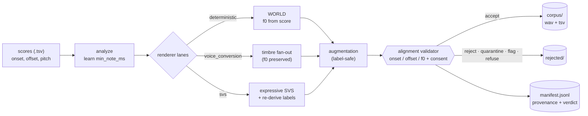
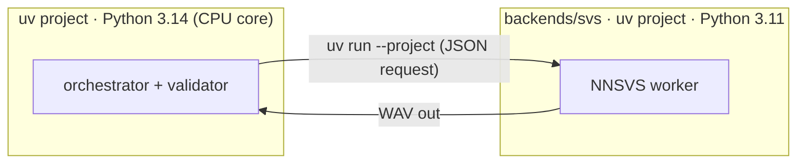

# voders

`voders` turns folders of singing scores into a training corpus of `(audio.wav, score.tsv)`
pairs whose labels are **correct by construction**. Each score is a list of
`(onset_s, offset_s, pitch_midi)` note rows; the pipeline renders singing audio from it and
keeps the score as the ground-truth label, so the label never has to be guessed back from the
audio. An alignment validator gates every sample, and a JSON Lines manifest records full
provenance (which voice, seed, license, and config produced each pair) for replay and audit.

The intended consumer is a transcription model that ingests 22,050 Hz mono float32 audio, so
every rendered sample uses that format.

## Purpose in one paragraph

Training a singing-transcription model needs lots of `(audio, note-labels)` pairs, and the hard
part is **label accuracy**: if a note's onset in the label doesn't match the audio, the model
learns from wrong data. The dominant risk is *alignment drift*, not audio realism. voders removes
that risk by generating the audio **from** the labels — pitch and timing are taken straight from
the score, so the labels are correct by construction — then **gates every sample** through an
alignment validator and records full **provenance** (voice, seed, license, config) so any sample is
auditable and reproducible. The result is a large, in-the-mix, license-clean synthetic corpus a
transcription model can train on with confidence.

## How it works



One declarative YAML config plus a single `master_seed` fully specify a run; the manifest hashes
the resolved config so a corpus replays from `manifest + scores` alone.

## The four renderer lanes

Each lane is enabled or disabled independently in the run config:

1. **deterministic** — drives the pitch directly from the score with the WORLD vocoder (a classic
   analysis/resynthesis vocoder that lets us replace a donor voice's pitch with a score-derived
   contour). This is the load-bearing CPU baseline: f0 (the fundamental frequency, i.e. the sung
   pitch) comes straight from the label, so alignment is exact.
2. **voice_conversion** — keeps the score-accurate timing and pitch but converts the timbre toward
   a target singer, for variety in voice identity.
3. **svs** — expressive neural singing-voice synthesis (SVS), which sings the score with natural
   phrasing; labels are re-derived and re-validated so expressive timing stays within tolerance.
4. **augmentation** — label-preserving production-style effects (noise, room, codec) applied to an
   accepted base render, multiplying the corpus without changing the score.

The deterministic lane and validator run on a laptop CPU with no GPU. The neural lanes
(`svs`, `voice_conversion`) use the `gpu` extra.

## Quickstart

Everything is driven by a [`just`](https://github.com/casey/just) task runner; each action goes
through uv under the hood (Python 3.14), so a fresh checkout needs no manual setup — every action
depends on `setup` (`uv sync`, a fast no-op when already current). Run `just` to list all actions.

Prerequisites: `just` (`sudo apt install just`) and, to build the `pyworld` wheel, a C/C++
toolchain (`sudo apt install build-essential`).

```bash
just                                   # list all actions
just smoke                             # render the fixture corpus, then evaluate it (end-to-end)
just run config=evals/fixtures/smoke.yaml   # render a corpus from a run config
just eval                              # evaluate against the Success Criteria (non-zero on failure)
just audit                             # license/consent audit
just stats                             # aggregate corpus statistics
```

`just run` writes under `out/<run_id>/`: `config.resolved.yaml` (the resolved end-result record),
`manifest.jsonl` (one provenance row per attempted sample), `stats.json`, `corpus/` (accepted
`wav`+`tsv` pairs), `rejected/` (non-accepted samples, never trained on), and `checkpoints/`. The
`out/` tree is git-ignored — generated corpora are never committed.

## Running tests / development

```bash
just test            # full test suite
just lint            # ruff check + ruff format --check + mypy (zero-warning gate)
just fmt             # auto-format
just bench           # deterministic-lane throughput vs the SC-005 floor
just check           # lint + test (what CI runs)
```

## GPU and neural backends

```bash
just setup-gpu            # add the gpu extra (torch / torchaudio / torchcrepe)
just smoke-gpu           # render, then validate with CREPE (neural f0) on the GPU
just download-rvc-models # fetch the RVC base model weights into models/ (git-ignored)
just demo-svs-nnsvs      # run the SVS lane via its out-of-process NNSVS backend
```

`just setup-gpu` installs torch/torchaudio/torchcrepe (Python 3.14 wheels; verified on an NVIDIA
GB10). **Validator on GPU:** a run config with `validator.f0_method: crepe_f0` measures pitch with
CREPE — a neural f0 (fundamental-frequency) estimator — on the GPU instead of the CPU `pyin`
fallback; `just smoke-gpu` demonstrates it. The CPU default stays `pyin_f0` so the baseline needs
no GPU (FR-009).

**Out-of-process backends.** Lane toolkits whose dependency chains conflict with the 3.14 core live
in their own uv projects under `backends/` (own `pyproject.toml` / `.python-version` / `uv.lock`).
The core invokes them with `uv run --project backends/<name>` and exchanges a JSON request plus a
WAV, so the incompatible chains never share an interpreter. `backends/svs` runs NNSVS on Python
3.11 (`just demo-svs-nnsvs`).



**Neural voice models need consented weights.** Real voice conversion / neural SVS need a *trained
voice model* for a specific singer (an RVC `.pth`, an NNSVS/DiffSinger voicebank) — large external
assets, and exactly what the consent gate (FR-011, SC-008) governs, so the repo bundles none.
`just download-rvc-models` fetches the RVC **base** models (HuBERT + RMVPE feature extractors — not
a cloned voice); a target singer model is supplied per voice via its `model_ref`. The CPU backends
(`backend: world` / `backend: cpu`) reproduce each lane's contract without a GPU or external
weights, so the whole pipeline and its evaluation run on a laptop.

## Reproducibility

A single run-level `master_seed` derives every per-sample seed, so any one sample reproduces in
isolation from the manifest plus the source scores. The deterministic and voice-conversion lanes
reproduce bit-for-bit; the neural lanes reproduce to within the validator's tolerances.
