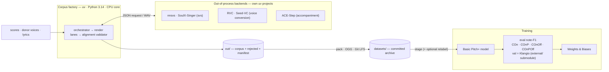
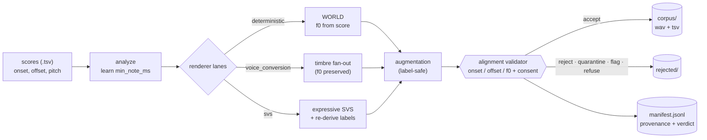

# voders

A factory for singing-transcription training data, plus the model trained on it.

- **What** — turns folders of note scores (`onset_s  offset_s  pitch_midi` TSV rows) into `(audio.wav, score.tsv)` pairs.
- **Why** — labels are **correct by construction**: audio is rendered *from* the score, so onset/offset/pitch are never guessed back from audio (alignment drift is the dominant risk, not audio realism).
- **Guarantees** — an alignment validator gates every sample; a JSONL manifest records full provenance (voice, seed, license, config) for replay/audit. Audio is 22,050 Hz mono float32.

## Architecture

Two halves — a CPU **corpus factory** and the **training** that consumes its output — with neural synthesis isolated in separate processes.



## Pipeline



- One declarative YAML config + one `master_seed` fully specify a run; the manifest hashes the resolved config so a corpus replays from `manifest + scores` alone.
- Every per-sample seed derives from `master_seed`, so any one sample reproduces in isolation. Deterministic/VC lanes are bit-exact; neural lanes reproduce to within validator tolerances.

## Renderer lanes

Each lane is toggled independently in the run config. None of these aim for realistic singing — the point is exact labels.

- **deterministic (WORLD)** — replaces a donor vowel's pitch with the score's f0. Produces a sustained vowel at exact pitch/timing; it sounds synthetic, not like a real singer. Value is label exactness, not realism. CPU, no GPU.
- **voice_conversion (RVC / Seed-VC)** — keeps score pitch/timing, swaps timbre toward a target singer. Changes voice identity only. RVC needs a trained `.pth`; Seed-VC is zero-shot from a reference clip. GPU.
- **svs (nnsvs / SoulX-Singer)** — neural voicebanks that sing the score with lyrics; more natural than WORLD but still recognisably synthetic, and tied to a specific voicebank. In `force_score_f0` mode the sung timing drifts from the rigid score grid, so labels are re-derived from the audio (`rederive`) and re-validated. GPU. (SoulX is wired but largely unusable — see [What didn't work](#what-didnt-work).)
- **augmentation** — label-preserving effects (`room_reverb`, `phone_codec`, `noisy_codec`) on an accepted render; audio only, labels untouched.

## Synthesis methods (attempted)

Every voicing engine tried, with honest status:

| Method | Lane | What it is | Status |
|---|---|---|---|
| **WORLD** | deterministic | analysis/resynthesis vocoder; swaps a donor vowel's f0 for the score's → sustained vowel at exact pitch/timing | **Primary** — synthetic sound, exact labels, CPU baseline |
| **nnsvs** | svs | neural SVS voicebank singing the score + lyrics | **Used** — natural-ish; `force_score_f0` labels drift → `rederive` |
| **RVC** | voice_conversion | timbre conversion to a trained target singer (`.pth`), pitch preserved | Used — voice variety; needs consented weights |
| **Seed-VC** | voice_conversion | zero-shot timbre conversion from a reference clip, pitch preserved | Used (demo) — no per-voice training |
| **SoulX-Singer** | svs | zero-shot SVS in a reference timbre | **Failed** — sings too freely (~330 ms drift); labels don't validate; not used |
| **Vocos** | deterministic (exp) | neural re-vocode of the WORLD output | **Failed** — not f0-conditioned; detunes past ±25 cents; gate rejects it |
| **ACE-Step** | accompaniment | generates instrumental backing (not vocals) | Used (GPU) — optional accompaniment stage |

## Alignment validator (how labels are checked)

Every sample is gated by measuring the rendered audio's pitch (`pyin` on CPU, `CREPE` on GPU) and checking each note against its score label, after compensating the estimator's group delay:

- **onset** — the note's *rising edge* (first in-tune frame following an out-of-tune one) must be within **±50 ms** of the label.
- **offset** — the note's *falling edge* must be within **±max(50 ms, 20% of note duration)** of the label.
- **pitch (f0)** — ≥**80%** of the note's sustained frames must lie within **±25 cents** of the score pitch.
- **also gated** — SNR floor, clipping, and per-voice license/consent.

Per-sample verdict (`accepted` · `rejected` · `quarantined` · `flagged` · `license_refused`) is recorded in the manifest. Deterministic-lane labels are exact by construction; SVS labels are re-derived from the audio (`rederive`) and then passed through this same gate.

## Quickstart

Driven by [`just`](https://github.com/casey/just); every recipe runs through `uv` (Python 3.14), so a fresh checkout needs no manual setup. Prereqs: `just` and a C toolchain (`build-essential`, for the `pyworld` wheel).

```bash
just                    # list all recipes
just smoke              # render the fixture corpus, then evaluate it end-to-end
just run config=evals/fixtures/smoke.yaml   # render a corpus from a config
just eval               # check against Success Criteria (non-zero on failure)
just audit              # license/consent audit
just stats              # aggregate corpus stats
just splits             # source-stratified train/val splits
```

**Output** under `out/<run_id>/` (git-ignored, never committed): `corpus/` (accepted `wav`+`tsv`), `rejected/` (gated out, never train on it), `manifest.jsonl` (one row per attempted sample), `stats.json`, `config.resolved.yaml`.

## Transcription model (Basic Pitch+)

Extends Spotify's Basic Pitch for monophonic singing transcription (MML hackathon 2026).

- **I/O** — 16 kHz audio, hop 256 → 62.5 fps; onset + frame (note) + contour heads over 127 MIDI pitches.
- **Decode** — onsets by peak-picking; offsets by where the frame posterior crosses a threshold.
- **Data** — trains on the rendered corpus (`Synthetic` dataset); validates on the held-out Klangio set (`external/MML26-singing-synthesis` submodule).
- **Metrics** (mir_eval note-F1): `COn` (onset), `COnP` (+pitch), `COnOff` (+offset), `COnPOff` (all), `pitch_mse`.

```bash
just train                    # stage committed datasets -> train (val on Klangio), stream to W&B
just train-synthetic          # A/B: train on synthetic-only data, still val on Klangio
RELABEL=1 just train          # re-derive offset labels from audio during staging (repair-only)
FRAME_WEIGHT=8 just train     # override the frame-head loss weight (default 16)
just klangio-fifth N          # render the Nth fifth of the Klangio melodies into the training set
```

### Approaches tried (offset accuracy)

Onsets/pitch were strong; **offsets** lagged. The wins, by category:

- **Label quality**
  - SVS labels re-derived from audio (`rederive` mode) instead of pinned to the rigid score grid (`force_score_f0`), via f0 DTW alignment anchored to the score timeline.
  - Repair-only, validator-gated relabel during staging (`RELABEL=1`) — keeps already-valid labels byte-for-byte; one shared f0 pass; crash-safe (full corpus staged before any relabel).
  - Synthetic-only training A/B (`just train-synthetic`) — the synthetic pools carry exact authored labels, while the `klangio_fifth_*` renders are built from machine transcriptions of unverified label accuracy. Earlier synthetic-only runs appeared to score higher, so this trains on the exact-label data only (val still on Klangio) to check whether the Klangio renders were dragging the scores down.
- **Offset supervision & decoding**
  - Offset-aware checkpoint selection (`COnPOff_f1`, was onset-only `COnP_f1`).
  - Frame-head class-imbalance fix: `FRAME_WEIGHT` (default 16, was 2) — the low weight collapsed the frame head and pinned offsets at the threshold floor.
  - Per-head loss weights; decoder offset-hangover rescaled to the frame rate (~128 ms); validator falling-edge offset measurement; keep note-tail chunks in the loader.

Result on Klangio val: raising the frame weight moved `COnPOff_f1` ~+50% and `COnOff_f1` ~+14% while halving pitch error (metric definitions unchanged — same mir_eval matching/tolerances).

### What didn't work

- **SoulX-Singer (zero-shot SVS)** — sings far too freely (~330 ms median timing drift vs the score); the re-derived labels failed validation on every test render. Wired up but not used in the corpus.
- **`force_score_f0` labels for neural SVS** — the voicebank's actual timing drifts from the rigid score grid (~39% of note offsets land >50 ms off the audio's real voicing end). This is what motivated the `rederive` relabel.
- **`frame-weight 2` (old default)** — too low for the ~200:1 frame class imbalance, so the frame head collapsed and offsets pinned at the threshold floor. Replaced by `FRAME_WEIGHT=16`.
- **Vocos neural vocoder** — the plain mel model isn't f0-conditioned, detunes past the validator's ±25-cent tolerance, and gets rejected (gate working as designed). Lesson recorded in code: realism needs an f0-conditioned vocoder (BigVGAN-f0 / NSF).

### Training data volumes

Minutes of audio per committed dataset (`datasets/<id>/`, 22,050 Hz mono):

| Dataset | Minutes | Clips | Synthesis | Labels |
|---|---|---|---|---|
| `donor_pool` | 35 | 759 | WORLD + augmentations | exact (authored) |
| `lyrics_pool` | 1.7 | 37 | nnsvs | `force_score_f0` |
| `lyrics_pool_words` | 1.8 | 40 | nnsvs | `force_score_f0` |
| `melody_pool` | 41 | 371 | nnsvs | `force_score_f0` |
| `klangio_fifth_0..4` | 535 | 6,603 | nnsvs | Klangio transcription |
| **total** | **~618** | **7,874** | | |

- **`just train-synthetic`** (donor + lyrics + words + melody) ≈ **80 min** (~1.3 h); `RUN_IDS="donor_pool"` alone ≈ **35 min**.
- **`just train`** (adds the five Klangio fifths; donor capped to 40 clips) ≈ **9 h**, ~99% Klangio.
- Validation is the held-out Klangio set under `external/` — not counted above.

## Consuming the corpus

- **Layout** — train on `corpus/` only; each `*.wav` has a sibling `*.tsv` (`onset_s  offset_s  pitch_midi`, byte-identical to the driving score). Never train on `rejected/`.
- **Provenance** — `manifest.jsonl`: one row per attempted sample (`sample_id`, `lane`, `voice_id`, `augmentation_profile`, `seed`, license/consent, `verdict`). `sample_id` encodes it: `score_<id>_singer_<voice>` + `_aug_<profile>` for variants.
- **Splits** — `just splits` writes `splits.json` train/val lists stratified by source (lane/voice/aug profile), deterministic in `--seed`.
- **Quality gate** — validator checks onset (50 ms), offset, and f0 (±25 cents over ≥80% of each note). `just basic-pitch-eval` scores the rendered audio with the downstream model, broken down by verdict and source.

### Committed dataset archive

Rendering is slow, so accepted audio is archived under `datasets/<run_id>/` as OGG/Vorbis (~17× smaller, Git LFS) with verbatim labels + manifest + stats.

```bash
just pack-corpus     # out/<id>/ -> datasets/<id>/ (then commit datasets/)
just unpack-corpus   # datasets/<id>/ -> out/<id>/corpus/*.wav (float32)
```

OGG is lossy (audio not bit-exact); labels/provenance are exact. Only accepted audio is archived; the manifest still lists rejections.

## Optional: lyrics (phonetic diversity)

Opt-in; adds consonant/vowel variety the bare "ah" vowel lacks. Never a label. No `lyrics` block → byte-identical to the lyric-free pipeline. One syllable per note; only the **svs** lane articulates them.

```yaml
lyrics:
  source: automatic     # vowel (default) | supplied | automatic | generated
  inventory: en_cv      # en_cv (neutral CV) | scat (jazz scat syllables)
  g2p_backend: espeak   # espeak (CPU, default) | neural (byT5 on GPU)
  languages: [en-us]    # spread coverage; one picked per sample, seeded
```

**Sources** — two of them *create* lyrics:

- **vowel** — default, lyric-free.
- **supplied** — per-note syllables in an optional 4th TSV column (author-provided).
- **automatic** — seeded CPU syllable sampler; draws singable syllables from a checked-in inventory (`en_cv` / `scat`). Deterministic, dependency-free.
- **generated** — an instruct LLM (`Qwen2.5-0.5B-Instruct`, GPU) writes themed real words, segmented to one syllable per note. Unverified model licenses are refused.

**Pipeline:** `per-note syllables → G2P (espeak | byT5) → vowel-on-the-beat placement → svs lane sings them → alignment validator`. The vowel nucleus carries the pitch from the note onset; consonants sit in short pre-onset/pre-offset windows, so the *labelled* onset stays on the beat — the alignment risk the validator then checks.

**Reproducibility:** `automatic` reproduces from the seed. `generated` is **pinned to a cache artifact** — the (non-deterministic) LLM runs once per `(theme, model, score, seed, n_notes)`, its text is written to `out/<run>/lyrics/<key>.jsonl`, and every replay reuses that file with no model call. So a generated corpus replays byte-identically from the pinned text; the model only ever fills an empty cache.

```bash
sudo apt install espeak-ng && uv sync --extra lyrics   # CPU G2P
just run config=evals/fixtures/lyrics-svs.yaml         # svs lane articulates syllables
uv run pytest -m gpu                                   # opt-in GPU paths (LLM / neural G2P)
```

## Optional: score-domain augmentations

Opt-in pre-render stage; fans out score *variants* (labels still correct by construction). Off by default. Variants go to a separate `corpus/augmented/<axis>/` subtree; `score_id` encodes the transform (e.g. `score_000__t+12`).

```yaml
score_augmentation:
  - profile_id: all-axes
    transpose:     { offsets: [-12, 12], policy: drop, window: [0, 127] }
    humanize_time: { onset_sigma_s: 0.02, duration_sigma_s: 0.02, max_dev_s: 0.05, draws: 2 }
    volume:        { gain_db_range: [-6.0, 6.0], distribution: uniform }
```

## Optional: accompaniment (spec 002)

Lays instrumental backing under an accepted vocal **without moving sung-note timing**, so the score still labels the mix.

- **lego** — generated stem summed under a bit-exact vocal (stem kept for re-mixing).
- **complete** — one-pass full mix, mild vocal coloration.
- Backends: **fake** (CPU/CI) and **ACE-Step** (`ACE-Step-v1-3.5B`, GPU, out-of-process).

```bash
just demo-acestep   # real ACE-Step accompaniment on a fixture vocal, then eval
```

## Donor voices (data sources)

Permissive, consented vowel sources for the deterministic/VC lanes; all land git-ignored under `models/donors/`.

- `just download-donors` — VocalSet + VCTK (CC BY 4.0).
- `just download-freesound` — short sung vowels (CC0 default; set `FREESOUND_API_TOKEN`).
- `just record-donor <id> RECORD=1` — capture + consent your own vowel from the mic.
- `just list-donors` — show enrolled donors with license/attribution.
- `just augment` — enroll all sources → unified pool → render → augment → audit → eval → stats (what the `data-augmentation` Action runs).

## GPU & out-of-process backends

- `just setup-gpu` — torch/torchaudio/torchcrepe (Python 3.14 wheels; verified on NVIDIA GB10).
- `just smoke-gpu` — validate pitch with CREPE (neural f0) instead of CPU `pyin`. Config: `validator.f0_method: crepe_f0`, `f0_device: auto` (probes `cuda → xpu → dml → cpu`).
- **Out-of-process backends** — toolkits whose deps conflict with the 3.14 core live as standalone uv projects under `backends/` (own `pyproject.toml` / `.python-version` / `uv.lock`); the core calls them via `uv run --project` exchanging a JSON request + WAV. Examples: `backends/svs` (nnsvs, Py 3.11), `backends/soulx` (SoulX-Singer), `backends/acestep`, RVC (Py 3.10, `fairseq`).

```bash
just demo-svs-nnsvs   # svs lane via the out-of-process NNSVS backend
just demo-rvc         # voice conversion (RVC)
just demo-seedvc      # zero-shot VC (Seed-VC, reference clip, no per-voice .pth)
```

## Develop

```bash
just test     # full test suite (CPU; GPU paths behind -m gpu)
just lint     # ruff check + ruff format --check + mypy (zero-warning gate)
just fmt      # auto-format
just bench    # deterministic-lane throughput vs the SC-005 floor
just check    # lint + test (what CI runs)
```

Built spec-first: each feature is a numbered `specs/NNN-*/` folder (`spec → research → plan → data-model → contracts → quickstart → tasks`) under a constitution (`.specify/memory/constitution.md`) — TDD, zero-warning lint, docs-current, evaluation-first.
